# ZedBoard ZYNQ-7000 ARM/FPGA SoC

The ZedBoard™ is an affordable development board for the Xilinx ZYNQ®-7000 SoC, which includes all the components needed to build a design using Linux, Android, Windows® or other OS/RTOS. It also features expansion connectors for easy access to the processing system and programmable logic I/Os, enabling the creation of unique designs utilizing the ZYNQ-7000 SoC's integrated ARM® processing system and 7 series programmable logic.

## Stopwatch

The ZedBoard has a total of five pushbuttons, which are connected to the FPGA. Additionally, there are two more pushbuttons available, but these can only be used by the ARM processor and not by the FPGA fabric. To use the button inputs in our module, we need to declare them. We have the option to either declare them as five separate inputs or as a 5-bit bus. I prefer to use the bus method.

In order to control the counter, we simply need to control the flow of time. The actual mechanism that performs this function in our design is the "counter count" - it counts up to (ms_limit-1), then resets back to zero. Additionally, it generates the "millisecond pulse" signal (ms_pulse). To start and stop the counter, we create a "count_enable" signal. This signal is initially set to zero, and is then set to high when the "btnr_rise" event occurs, and low when the "btnc_rise" event occurs.

### Schematic

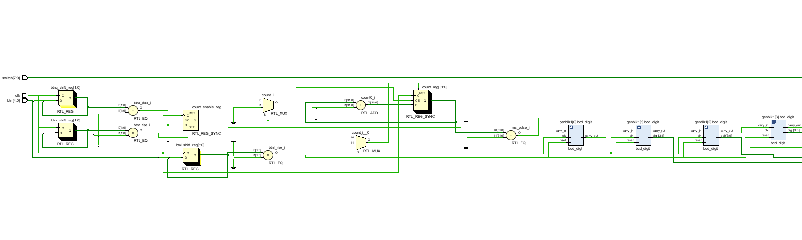

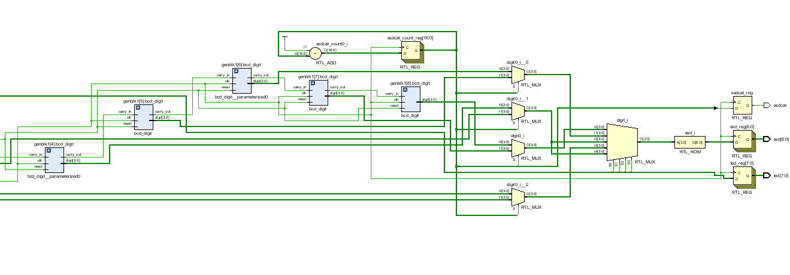

### Simulation

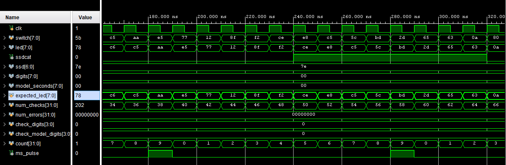

You can observe that the actual led value is always equal with the expected one.

## Button debounce

Mechanical switches and buttons have an inherent characteristic known as "bounce." This means that the switch does not smoothly transition from an open to closed state, or vice versa. Instead, it rapidly oscillates between the two states for a brief period of time. To eliminate this issue, we only want the switch to register a single transition, rather than multiple bounces, when it is closed or opened.

We plan to incorporate a mechanism that tallies for a specific duration, allowing enough time for any bouncing to conclude. This mechanism will initiate whenever the input signal experiences a transition, and will discontinue if the input signal bounces before the mechanism completes its count. The duration we have chosen for this mechanism is 10ms, which should be sufficient for the input signal to stabilize. To accomplish this, we will need to store two separate values for the mechanism. In the event that the input signal is transitioning from a low to high state and bounces, we will observe the signal transitioning from high to low and then back to high. Similarly, if the input signal is transitioning from high to low and bounces, we will observe the signal transitioning from low to high and then back to low.

To manage the functioning of counters and updating of registers, we will be utilizing a specific type of logic referred to as a "state machine." A state machine is composed of a variable that holds a state value, a set of inputs, and a set of outputs or actions. It can transition between states in response to different inputs. A state machine is often illustrated in documentation using a "state transition diagram." Our design calls for a state machine with four states. The state machine begins in an idle state, waiting for an input signal. Once an input signal is detected, it enters the "wait_1st" state and awaits for any bouncing to conclude. If the timer expires, the state machine returns to the idle state. If a transition is detected before the timer expires, the state machine stores the count value in the "period0" register and enters the "wait_2nd" state. In this state, the state machine waits for another transition of the input signal. This transition will always be caused by bouncing and not a legitimate press and release of the input. Once another transition is detected, the state machine updates the "period1" register and enters the "triggered" state.

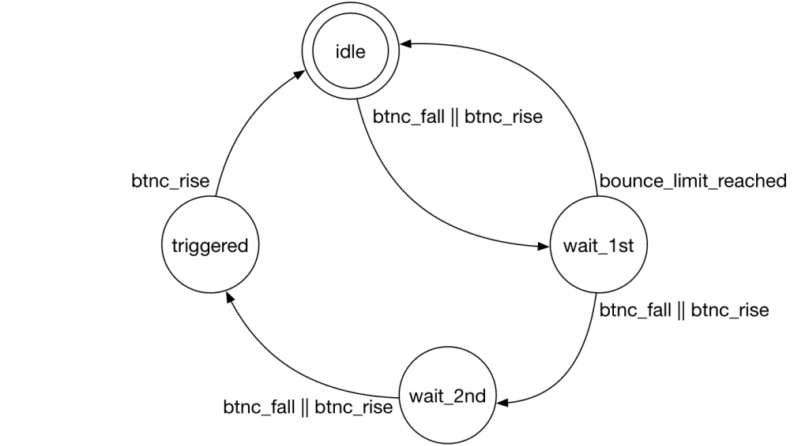

We will create a module that will smoothen out the signal from a switch or button. It will require a clock signal and the switch signal as inputs and produce a refined switch output, as well as output signals for switch rising and falling edges. It will also accept a parameter that defines a lockout period to ignore any bouncing. The strategy for this module is to detect a transition in the switch input and maintain that state for a number of clock cycles specified by the parameter. Any bouncing during that period will be disregarded by the circuit.

### Schematic

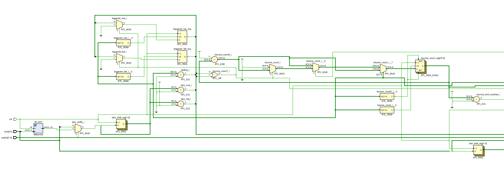

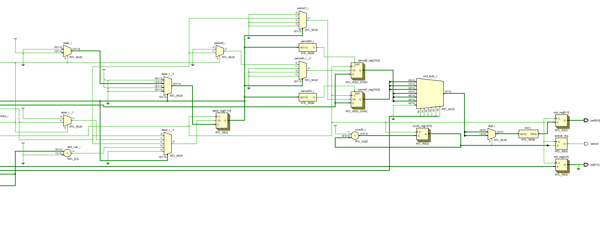

### Simulation

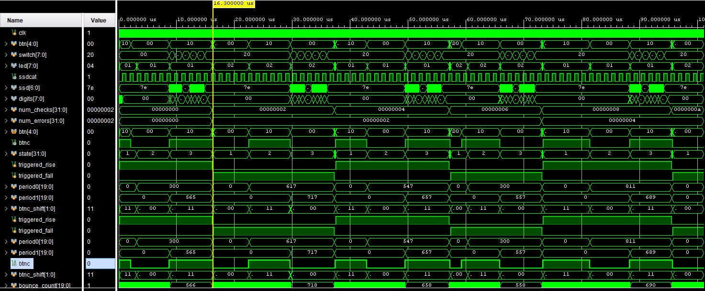

## Rotary Encoder

The PmodENC rotary encoder from Digilent is relatively easy to use. It has four input connections to the FPGA: a sliding switch input from a separate switch on the module, a push button input that is active when the shaft is pressed, and two additional inputs (a and b) that are triggered by the rotation of the shaft. Essentially, the rotation of the shaft causes two switches to be pressed alternatively. The input switches are referred to as a and b. When the switch is rotated in one direction, input "a" changes state before input "b". And when rotated in the opposite direction, input "b" changes state before input "a".

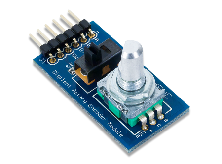

In this application, we monitor for the rising edge of input "a" to determine when the shaft is rotated. The state of input "b" when input "a" rises will indicate the direction of the rotation. It may be tempting to use input "a" as a clock signal in this situation. However, doing so will cause numerous issues. The synthesis and place and route tools need to be aware of the timing relationships between all signals in the design to ensure that it will function at the specified clock frequency.

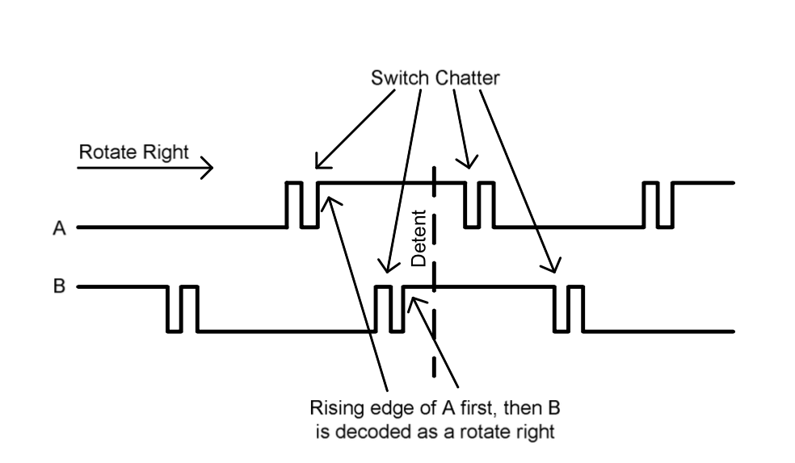

### Schematic

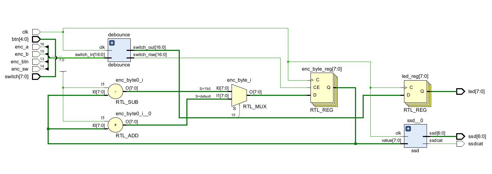

## I2C receiver

A widely-used method for transmitting audio data is the I2S protocol, which is a serial protocol very similar to another protocol, SPI, but it is a streaming protocol which means it always transmits data.

I2S sends a stream of stereo audio data, where each audio sample has a left channel and a right channel value. These values can be of different bit sizes, however, 16, 20, 24, and 32 bit values are the most widely used. To understand the protocol in more detail, it is recommended to refer to the I2S Bus Specification.

Three signals are involved in transmitting audio data: a serial clock (SCK), a word strobe signal (WS), which indicates if the data is for the left or the right channel, and a serial data signal (SD). The WS and SD signals are synchronized with the SCK signal and change on the falling edge of the SCK. The data is sent with the most significant bit first and one wrinkle is that the data is one cycle late with respect to the word strobe. The timing diagram provides further clarification.

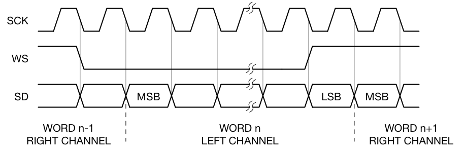

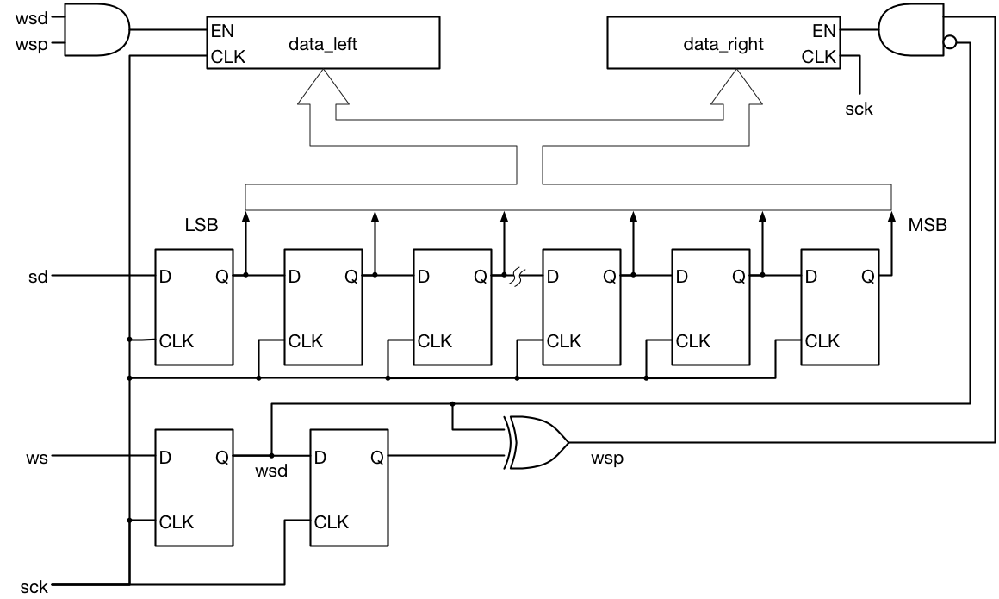

### Schematic

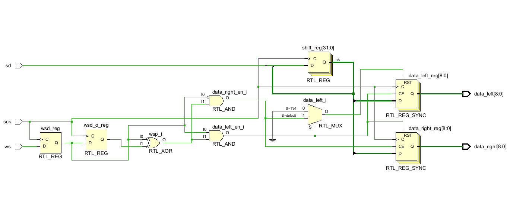

## I2C transmitter

An I2C transmitter is a device that sends data to other devices on the I2C bus. It is responsible for generating the necessary clock and data signals, and for formatting the data to be sent in the correct format. I2C transmitters are commonly used in a wide range of electronic devices, including smartphones, tablets, laptops, and industrial control systems.

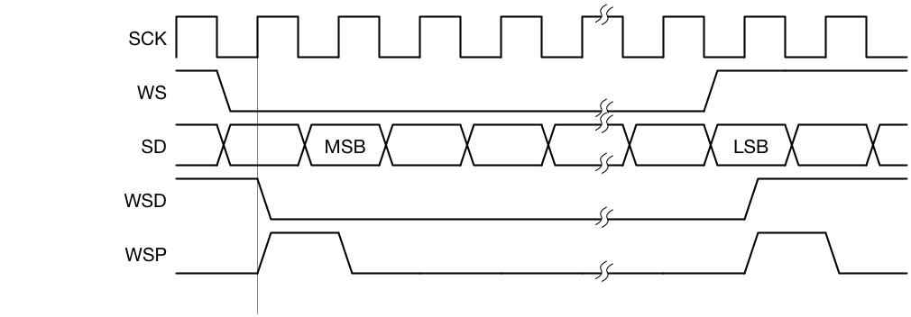

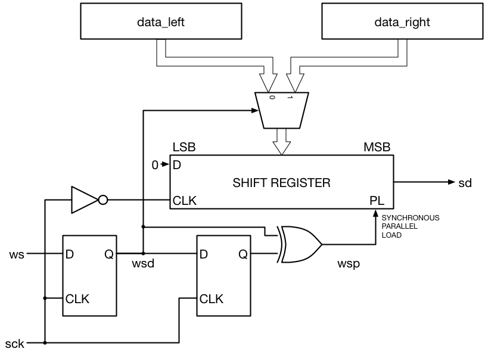

### Schematic

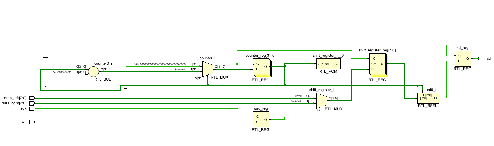

### Simulation

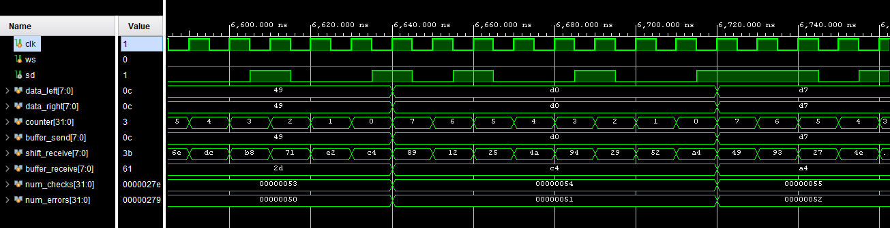

